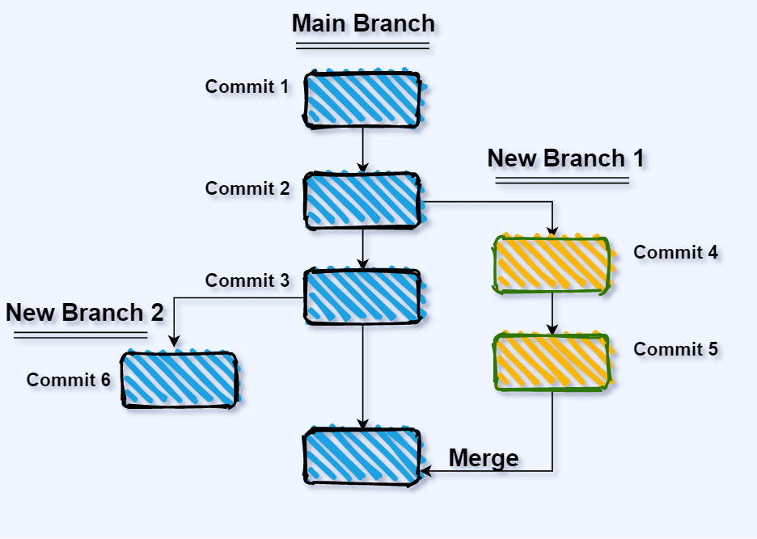

# Overview of Git and GitHub

---

## What is Version Control?

- A system that **tracks changes** to files over time.  
- Lets you **revert** to earlier versions if needed.  
- Critical for **collaboration** in software projects.  

**Why It Matters:**  
- Keeps a **history** of your work.  
- Helps **teams work together** without overwriting each other.  
- Protects against **losing work**.  

---

## A Brief History

- **Early Days:**  
  - Centralized systems like CVS and Subversion.  
  - One main server held all the history.  
- **Today:**  
  - Distributed systems like Git and Mercurial.  
  - Every user has a full copy of the project.  

---

## Git vs. GitHub: What's the Difference?

- **Git is NOT GitHub** – they are different tools with different purposes!  
- **Git**:  
  - A **version control system**.  
  - Tracks changes to your files (like a time machine for code).  
  - Works locally on your computer.  
- **GitHub**:  
  - A **hosting service** for Git repositories.  
  - Stores your Git projects online and adds collaboration features.  

**Simple Analogy:**  
- **Git** = a **toolbox** (tools to manage your work).  
- **GitHub** = a **workshop** (a place to store and share your tools).  

---

--- 

## What is Git?

- A **distributed version control system**.  
- Created by Linus Torvalds in 2005 for Linux development.  
- Focuses on **speed**, **reliability**, and **flexibility**.  

**Key Features:**  
- Work **offline** with local repositories.  
- **Branching** for experimenting with changes.  
- **Secure history** with cryptographic tracking.  

---

## Git vs. Other Systems

- **Centralized (e.g., Subversion):**  
  - One central server.  
  - Need internet to commit or view history.  
- **Distributed (e.g., Git):**  
  - Full copy on your machine.  
  - Work anywhere, sync later.  

**Why Choose Git?**  
- Fast and lightweight.  
- Great for teams and solo developers alike.  

---

## Repositories in Git

- **Local Repository:**  
  - Your personal copy of the project.  
  - Contains all files and history.  
- **Remote Repository:**  
  - A shared copy online (e.g., on GitHub).  
  - For collaboration and backups.  

**Key Action:**  
- `git clone`: Copy a remote repo to your machine.  

---

## Commits: Saving Your Work

- **Commit:** A snapshot of your project at a moment.  
  - Like saving a checkpoint in a game.  
  - Gets a unique ID (hash).  
- **Staging:** Pick what changes to save.  

**Commands:**  
- `git add <file>`: Stage your changes.  
- `git commit -m "message"`: Save them.  

---

---

## Branches: Parallel Worlds

- **Branch:** A separate version of your project.  
  - Work on new features without breaking the main code.  
- **Main Branch:** Often called `main` or `master`.  

**Commands:**  
- `git branch feature`: Make a new branch.  
- `git checkout feature`: Switch to it.  

---

## Merging: Bringing It Together

- **Merging:** Combines branch changes into another branch.  
  - E.g., add your feature to `main`.  
- **Conflicts:** When changes clash, you resolve them manually.  

**Command:**  
- `git merge feature`  

---

--- 

## What is GitHub?

- A **platform** for hosting Git repositories online.  
- Adds **team tools**:  
  - **Pull Requests:** Suggest and review changes.  
  - **Issues:** Track tasks and bugs.  
- Makes collaboration easier and more visible.  

---

## Git + GitHub: Syncing Up

- **Clone:** `git clone <url>` – Get a repo from GitHub.  
- **Push:** `git push` – Send your changes to GitHub.  
- **Pull:** `git pull` – Get updates from GitHub.  

**Analogy:**  
- Like syncing a shared document with your team.  

---

--- 

## Pull Requests: Team Reviews

- **Pull Request (PR):**  
  - Ask to merge your branch into another.  
  - Team can review and comment.  
- **Steps:**  
  1. Push your branch to GitHub.  
  2. Open a PR online.  
  3. Discuss and merge.  

---

## Issues: Tracking Work

- **Issues:** To-do lists for your project.  
  - Report bugs, plan features.  
  - Link to PRs for solutions.  
- **Why Use Them?**  
  - Keeps everyone on the same page.  

---

## Collaboration Styles

- **Shared Repo:**  
  - Team works directly in one repo.  
  - Good for small, trusted groups.  
- **Fork & Pull:**  
  - Copy the repo, work, then PR back.  
  - Common in open-source projects.  

---

## Best Practices

- **Commit Often:** Small changes are easier to track.  
- **Good Messages:** “Fixed bug” vs. “Updated login logic to handle errors”.  
- **Branch Liberally:** Keep `main` stable.  
- **Review PRs:** Catch issues early.  

---

## Git Workflows

- **Gitflow Example:**  
  - `main`: Stable code.  
  - `develop`: Work in progress.  
  - `feature/*`: New ideas.  
- **Why?**  
  - Organizes team efforts.  

---

## CI/CD: Automation

- **CI/CD:** Test and deploy code automatically.  
- **GitHub Actions:**  
  - Runs tests when you push.  
  - Can deploy to servers.  
- **Benefit:** Less manual work, fewer bugs.  

---

## Live Demo

- **What We’ll Do:**  
  - Clone a repo.  
  - Make a branch and commit.  
  - Push and create a PR.  
  - Look at PRs
  - See Contributors

---

## Q&A

---
