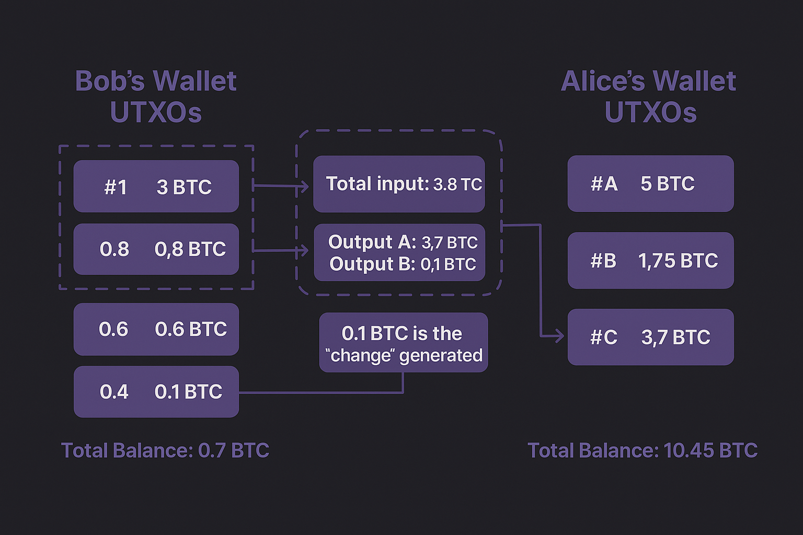
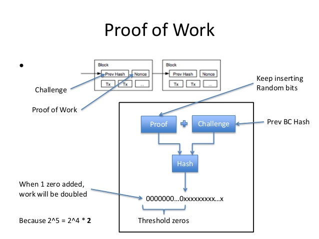
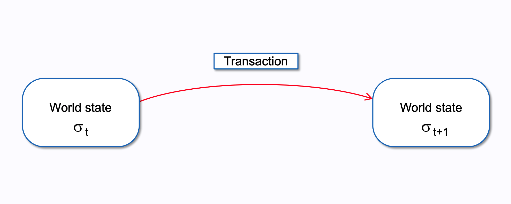
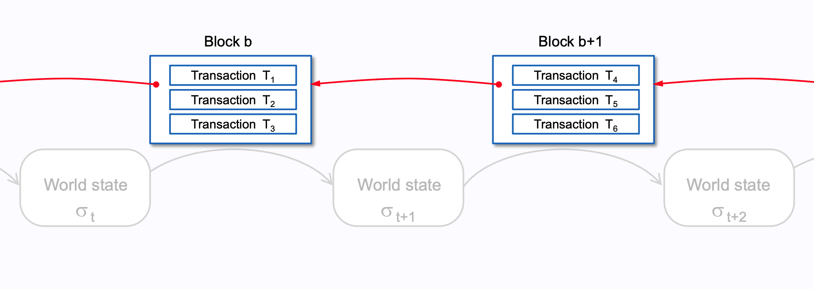
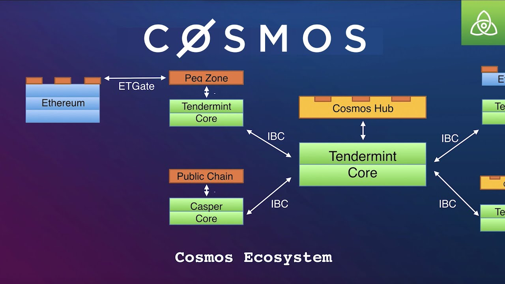
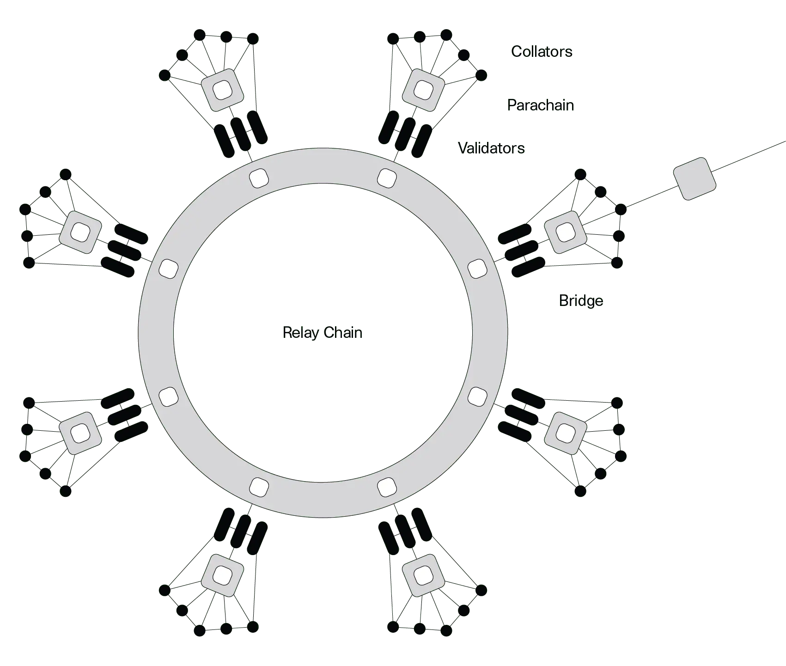
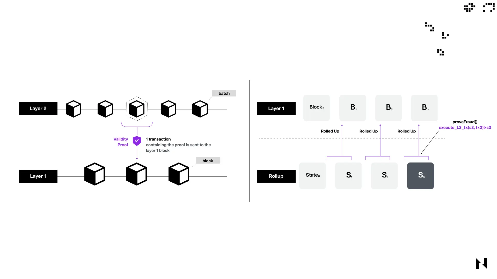

# Web3 Technical Overview

**Date:** Monday, March 31, 2025  

A technical overview about the Web3 and Blockchain ecosystems.

---

## 1. Blockchain Ecosystem Overview

---

### What is Web3?
- **Web1 (1990s)**: Read-only internet (static pages, no interaction).  
- **Web2 (2000s-Now)**: Read-write internet (social media, centralized platforms).  
  - Issue: Centralization (e.g., data control by tech giants).  
- **Web3 (Now-Future)**: Read-write-own internet.  
  - Decentralized, user-controlled via blockchains.  
  - Core Tech: Blockchains enable trustless systems (no intermediaries).  
- **Ethereum’s Role**:  
  - Pioneered smart contracts, powers most Web3 dApps (e.g., DeFi, NFTs).  

<!-- Speaker Notes:  
Web3 is the next internet evolution. Web1 was static—think early websites. Web2 gave us interaction but centralized control—think Facebook owning your data. Web3 uses blockchains to decentralize, letting users own their data and interact trustlessly. Ethereum’s smart contracts are the backbone, running most Web3 apps like DeFi and NFTs. Sherlock audits these to keep Web3 secure.  
-->

---

### Bitcoin: Security Foundations
- **Proof of Work (PoW)**:  
  - Miners secure the network, but vulnerable to 51% attacks.  
- **UTXO Model**:  
  - Simple, less attack surface vs. account models.  
- **Why It Matters for Security**:  
  - Bitcoin’s simplicity = fewer bugs, but limited functionality.  

<!-- Speaker Notes: Bitcoin’s design prioritizes security over flexibility. Its UTXO model is less prone to certain attacks, but PoW’s energy cost is a trade-off. -->

---

---

---

### Ethereum: Smart Contract Risks
- **Smart Contracts**:  
  - Enable DeFi, but introduce complex vulnerabilities (e.g., reentrancy).  
- **EVM**:  
  - Gas model can be exploited (e.g., gas griefing).  
- **Security Focus**:  
  - Auditing smart contracts is critical—Sherlock’s bread and butter.  

<!-- Speaker Notes: Ethereum’s flexibility brings risks. Smart contracts are powerful but error-prone. Gas mechanics can be gamed. Sherlock audits these contracts to prevent exploits. -->

---

### Ethereum: Evolution and Security
- **The Merge (2022)**:  
  - PoS reduces energy use, but introduces new attack vectors (e.g., staking centralization).  
- **EVM Chains**:  
  - Clones (BSC, Avalanche) inherit Ethereum’s bugs + add their own.  
- **Security Implication**:  
  - More chains = more auditing opportunities.  

<!-- Speaker Notes: PoS changes the security model—less about mining power, more about stake distribution. EVM clones expand the attack surface, increasing demand for audits. -->

---

---

### The Ethereum Virtual Machine (EVM)
- **What Is It?**  
  - A virtual machine that executes smart contracts on Ethereum.  
- **Key Features**:  
  - Runs bytecode compiled from Solidity or Vyper.  
  - Gas-based: Every operation costs gas to prevent abuse.  
- **Role in Ethereum**:  
  - Powers dApps (e.g., Uniswap, Aave) by executing contract logic.  

<!-- Speaker Notes:  
The EVM is Ethereum’s engine—it runs the code behind dApps like Uniswap. Smart contracts are written in languages like Solidity, compiled to bytecode, and executed by the EVM. Gas fees ensure operations don’t run wild, but bugs like reentrancy can drain funds. Sherlock’s audits focus on these contracts to keep Ethereum secure. The diagram shows how code becomes actions on the blockchain.  
-->

---

---

---

---

### Ethereum Clients: Roles and Interaction
- **What Are They?**  
  - Software running Ethereum nodes (validate txs, maintain blockchain).  
- **Execution Clients**:  
  - Process txs, run EVM (e.g., Geth, Nethermind).  
- **Consensus Clients**:  
  - Manage PoS, propose blocks (e.g., Prysm, Lighthouse).  
- **How They Work Together**:  
  - Execution client processes txs → Consensus client builds blocks → Execution updates state.  
  - Modular design: Bugs in one don’t crash the other.  

<!-- Speaker Notes:  
Ethereum clients keep the network running. Execution clients like Geth handle transactions and smart contracts, while consensus clients like Prysm manage PoS and block creation. They work as a team: execution prepares data, consensus organizes it into blocks. This split makes Ethereum more resilient—bugs don’t cascade. The diagram shows their interaction.  
-->

---

### Client Diversity: Why It Matters
- **The Risk**:  
  - Over-reliance on one client (e.g., Geth ~70%, Prysm ~40%) risks network-wide failure if buggy.  
- **The Fix**:  
  - Use diverse clients (e.g., Nethermind, Lighthouse) to spread risk.  
- **Security Impact**:  
  - More diversity = stronger decentralization, fewer single points of failure.  

<!-- Speaker Notes:  
Client diversity is critical—too many nodes using Geth or Prysm means a single bug could crash Ethereum. Using alternatives like Nethermind or Lighthouse reduces that risk, boosting decentralization. Sherlock audits these clients to ensure they’re secure, protecting the network. The chart shows current client usage—still too concentrated!  
-->

---

### Bitcoin vs. Ethereum

| **Aspect**         | **Bitcoin**                     | **Ethereum**                     |
|--------------------|---------------------------------|----------------------------------|
| **Purpose**        | Store of value ("digital gold") | Programmable platform (dApps)    |
| **Consensus**      | Proof of Work (PoW)             | Proof of Stake (PoS, post-2022)  |
| **Scripting**      | Limited (e.g., multi-sig)       | Smart contracts via EVM          |
| **Scalability**    | 7 TPS                           | 15-30 TPS (pre-L2)               |
| **Block Time**     | ~10 minutes                     | ~12-15 seconds                   |
| **Security Model** | Mining power                    | Staked ETH (validators)          |

---

### Layer 2 Solutions: Security Trade-offs
- **Rollups**:  
  - Optimistic: Fraud proofs can be gamed.  
  - ZK: Complex cryptography, hard to audit.  
- **Sidechains**:  
  - Less secure than L1, bridge vulnerabilities.  

<!-- Speaker Notes: L2s are essential for scaling but introduce new risks. Optimistic Rollups rely on honest challengers, ZK-Rollups on sound math. Sidechains are only as secure as their bridges—prime targets for hackers. -->

---

### Solana: Why It Exists
- **Problem**: Most blockchains are too slow for mass adoption of dApps.  
- **Solution**: Solana delivers high throughput (up to 65,000 TPS) and low latency.  
- **Impact**: Supports high-performance applications at scale.  
- **Example**: Serum DEX powers high-frequency trading on Solana.  

<!-- Speaker Notes:  
Solana is all about speed—think 65,000 transactions per second versus Ethereum’s 15. It’s built to handle dApps like Serum DEX, where every millisecond counts.  
-->

---

### Solana: What’s Unique
- **Key Feature**: Proof of History (PoH).  
  - Timestamps transactions to streamline consensus and boost speed.  
- **Advantage**: Enables massive scalability without heavy reliance on sharding.  
- **Storage Account System**: Solana Programs are associated with a Storage Account and need to borrow storage.  
- **Security Note**: High throughput introduces concurrency risks in smart contracts.  

<!-- Speaker Notes:  
Proof of History is Solana’s secret sauce—it’s like a built-in clock for transactions, cutting consensus overhead. But that speed means smart contracts need extra scrutiny for timing bugs. Sherlock audits Solana’s Rust-based contracts to catch these issues.  
-->

---

### Cosmos: Why It Exists
- **Problem**: Blockchains operate in isolation, unable to communicate natively.  
- **Solution**: Cosmos enables developers to build custom, sovereign blockchains that interoperate via the Inter-Blockchain Communication (IBC) protocol.  
- **Impact**: Creates an "Internet of Blockchains" for seamless cross-chain functionality.  
- **Example**: Osmosis DEX runs as a standalone chain but connects to others via IBC.  

<!-- Speaker Notes:  
Cosmos tackles the silos in blockchain tech. Think of blockchains as isolated islands—Cosmos builds bridges with IBC, letting custom chains like Osmosis for DeFi thrive independently yet connect with others.  
-->

---

### Cosmos: What’s Unique
- **Key Feature**: Inter-Blockchain Communication (IBC) protocol.  
  - Allows sovereign chains to exchange data and assets securely.  
- **Advantage**: Developers can tailor blockchains to specific needs without sacrificing connectivity.  

<!-- Speaker Notes:  
IBC is Cosmos’s standout feature—it’s like the internet’s TCP/IP for blockchains. Each chain is independent, so a bug in one won’t crash all, but those IBC bridges need to be rock-solid. Sherlock audits these connections to prevent cross-chain exploits.  
-->

---

---

### Polkadot: Why It Exists
- **Problem**: New blockchains struggle to establish their own security.  
- **Solution**: Polkadot offers shared security through its Relay Chain, connecting specialized parachains.  
- **Impact**: Reduces the burden of bootstrapping security for individual chains.  
- **Example**: Acala (DeFi) and Moonbeam (EVM-compatible) leverage this model.  

<!-- Speaker Notes:  
Polkadot fixes the security startup problem. Instead of every chain building its own defenses, they tap into the Relay Chain’s shared security, letting them focus on their unique jobs—like Acala for DeFi.  
-->

---

### Polkadot: What’s Unique
- **Key Feature**: Shared security via the Relay Chain.  
  - Parachains inherit robust security without building it from scratch.  
- **Advantage**: Enables specialized chains under a unified security umbrella.  
- **Security Note**: Relay Chain bugs can affect all parachains, requiring thorough checks.  

<!-- Speaker Notes:  
Shared security is Polkadot’s edge—parachains get a head start by leaning on the Relay Chain. But if the Relay Chain has a flaw, it’s a network-wide risk, so auditing is critical. Sherlock ensures these systems are bulletproof.  
-->

---

---

## 2. How Layer 2s Work

---

---

### Rollups: Optimistic
- **Mechanism**:  
  - Assume txs are valid, challenge if fraud detected.  
- **Security Risks**:  
  - Delayed finality, fraud proof manipulation.  
- **Example**: Arbitrum.  

<!-- Speaker Notes: Optimistic Rollups are cost-effective but rely on vigilant challengers. If fraud proofs are flawed, the system breaks. Sherlock audits these mechanisms. -->

---

### Rollups: ZK
- **Mechanism**:  
  - Use zero-knowledge proofs for instant validity.  
- **Security Risks**:  
  - Cryptographic complexity, potential for zero-day exploits.  
- **Example**: zkSync.  

<!-- Speaker Notes: ZK-Rollups are cutting-edge but their math must be bulletproof. Sherlock’s auditors verify the cryptography and implementation. -->

---

---

### Other L2s: State Channels and Sidechains
- **State Channels**:  
  - Off-chain txs, settle on L1.  
  - Risk: Channel disputes, stale state.  
- **Sidechains**:  
  - Independent chains, bridge to L1.  
  - Risk: Bridge hacks (e.g., Wormhole).  

<!-- Speaker Notes: State channels are great for micropayments but disputes can be tricky. Sidechains are vulnerable at the bridge—Sherlock audits these critical points. -->

---

## 3. DeFi Protocols and Mechanisms

---

### DEXes: On-Chain
- **Uniswap**:  
  - AMM model, liquidity pools.  
  - Risks: Impermanent loss, oracle manipulation.  
- **Security Focus**:  
  - Audit pool logic, price feeds.  

<!-- Speaker Notes: Uniswap’s AMM is revolutionary but not without risks. Impermanent loss can drain liquidity providers, and bad oracles can skew prices. Sherlock audits these components. -->

---

### DEXes: Off-Chain
- **dYdX**:  
  - Off-chain order books, on-chain settlement.  
  - Risks: Front-running, off-chain data integrity.  
- **Security Focus**:  
  - Audit matching engines, settlement logic.  

<!-- Speaker Notes: dYdX offers speed but off-chain components introduce trust assumptions. Sherlock ensures the off-chain logic can’t be gamed. -->

---

### Lending & Borrowing
- **Key Features**:  
  - Overcollateralized loans (e.g., Aave, Compound).  
  - Flash loans (Aave): Borrow without collateral, repay instantly.  
  - Algorithmic interest rates (Compound): Rates adjust by supply/demand.  
- **Risks**:  
  - Flash loan attacks, liquidation bugs, rate manipulation.  
- **Sherlock’s Role**:  
  - Audits loan logic, collateral systems, rate models.  

<!-- Speaker Notes: Lending protocols like Aave and Compound let users borrow crypto by locking collateral. Aave’s flash loans are powerful but risky—used in attacks if not coded right. Compound’s rates adapt dynamically but can be gamed. Sherlock audits these to prevent exploits. -->

---

### DAOs and Governance
- **What Are They?**  
  - Decentralized Autonomous Organizations: Community-run protocols.  
  - Governance: Token holders vote on protocol changes.  
- **Key Features**:  
  - On-chain voting (e.g., via governance tokens).  
  - Proposals for upgrades, fee changes, etc.  
- **Risks**:  
  - Governance attacks (e.g., vote manipulation), proposal exploits.  
- **Sherlock’s Role**:  
  - Audits governance contracts for secure voting and execution.  

<!-- Speaker Notes: DAOs let communities govern protocols via token voting—think of it as a decentralized boardroom. But governance systems can be attacked if votes are manipulated or proposals are malicious. Sherlock audits these to ensure fair, secure decision-making. -->

---

### Stablecoins
- **DAI/USDS, or LUSD**:  
  - Decentralized, collateral-backed.  
  - Risks: Peg stability, oracle failures.  
- **USDC or USDT**:  
  - Centralized, fiat-backed.  
  - Risks: Custodial risk, regulatory pressure.  

<!-- Speaker Notes: Stablecoins are DeFi’s backbone. DAI’s peg relies on code and oracles—bugs can break it. USDC’s centralization is a different risk—Sherlock focuses on the code side. -->

---

## 4. Programming Languages in Web3

---

### Smart Contracts: Solidity
- **Use**: Ethereum, EVM chains.  
- **Security Challenges**:  
  - Reentrancy, integer overflows, gas limits.  
- **Sherlock’s Role**:  
  - Audit Solidity code for vulnerabilities.  

<!-- Speaker Notes: Solidity is the most common smart contract language, but it’s tricky. Common bugs like reentrancy can drain funds. Sherlock’s auditors are experts in spotting these. -->

---

### Smart Contracts: Rust
- **Use**: Solana, Polkadot.  
- **Security Challenges**:  
  - Memory safety, concurrency issues.  
- **Sherlock’s Role**:  
  - Audit Rust-based programs for logic flaws.  

<!-- Speaker Notes: Rust is safer than Solidity but not immune to bugs. Concurrency in Solana can lead to race conditions—Sherlock audits these high-performance contracts. -->

---

### Clients/L2s: Go and Rust
- **Go**:  
  - Ethereum Geth, Optimism.  
  - Risks: Consensus bugs, DoS attacks.  
- **Rust**:  
  - Parity, Solana.  
  - Risks: Memory corruption, performance bottlenecks.  

<!-- Speaker Notes: Client software is the backbone of blockchains. Bugs here can crash networks or enable attacks. Sherlock audits client code to prevent such failures. -->

---

### AppChains: Go
- **Cosmos SDK**:  
  - Build custom chains with Tendermint.  
- **Security Focus**:  
  - Audit chain-specific logic, IBC connections.  

<!-- Speaker Notes: Cosmos chains are modular but each has unique risks. IBC connections must be secure—Sherlock audits these custom implementations. -->

---

## 5. Quick Q&A
- **Key Takeaways**:  
  - Web3 is diverse, each part has unique security needs.  
  - Sherlock audits smart contracts, L2s, and more.  
- **Next**: Web3 Security & Cryptograhy (ZK, FHE, ...) Deep Dive.  

<!-- Speaker Notes: Let’s open the floor for questions. Remember, Sherlock’s audits cover the full spectrum—from smart contracts to L2s and beyond. Tomorrow, we’ll dive deeper into security techniques. -->

---
