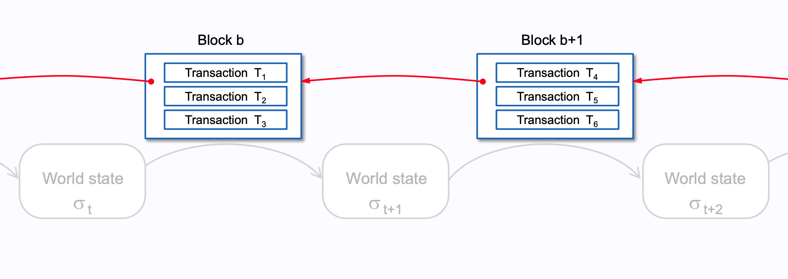

# Web3 Technical Overview

**Date:** Monday, March 31, 2025  

A technical overview about the Web3 and Blockchain ecosystems.

---

## 1. Blockchain Ecosystem Overview

---

### What is Web3?
- **Web1 (1990s)**: Read-only internet (static pages, no interaction).  
- **Web2 (2000s-Now)**: Read-write internet (social media, centralized platforms).  
  - Issue: Centralization (e.g., data control by tech giants).  
- **Web3 (Now-Future)**: Read-write-own internet.  
  - Decentralized, user-controlled via blockchains.  
  - Core Tech: Blockchains enable trustless systems (no intermediaries).  
- **Ethereum’s Role**:  
  - Pioneered smart contracts, powers most Web3 dApps (e.g., DeFi, NFTs).  

<!-- Speaker Notes:  
Web3 is the next internet evolution. Web1 was static—think early websites. Web2 gave us interaction but centralized control—think Facebook owning your data. Web3 uses blockchains to decentralize, letting users own their data and interact trustlessly. Ethereum’s smart contracts are the backbone, running most Web3 apps like DeFi and NFTs. Sherlock audits these to keep Web3 secure.  
-->

---

### Bitcoin: Security Foundations
- **Proof of Work (PoW)**:  
  - Miners secure the network, but vulnerable to 51% attacks.  
- **UTXO Model**:  
  - Simple, less attack surface vs. account models.  
- **Why It Matters for Security**:  
  - Bitcoin’s simplicity = fewer bugs, but limited functionality.  

<!-- Speaker Notes: Bitcoin’s design prioritizes security over flexibility. Its UTXO model is less prone to certain attacks, but PoW’s energy cost is a trade-off. -->

---

---

---

### Ethereum: Smart Contract Risks
- **Smart Contracts**:  
  - Enable DeFi, but introduce complex vulnerabilities (e.g., reentrancy).  
- **EVM**:  
  - Gas model can be exploited (e.g., gas griefing).  
- **Security Focus**:  
  - Auditing smart contracts is critical—Sherlock’s bread and butter.  

<!-- Speaker Notes: Ethereum’s flexibility brings risks. Smart contracts are powerful but error-prone. Gas mechanics can be gamed. Sherlock audits these contracts to prevent exploits. -->

---

### Ethereum: Evolution and Security
- **The Merge (2022)**:  
  - PoS reduces energy use, but introduces new attack vectors (e.g., staking centralization).  
- **EVM Chains**:  
  - Clones (BSC, Avalanche) inherit Ethereum’s bugs + add their own.  
- **Security Implication**:  
  - More chains = more auditing opportunities.  

<!-- Speaker Notes: PoS changes the security model—less about mining power, more about stake distribution. EVM clones expand the attack surface, increasing demand for audits. -->

---

---

### The Ethereum Virtual Machine (EVM)
- **What Is It?**  
  - A virtual machine that executes smart contracts on Ethereum.  
- **Key Features**:  
  - Runs bytecode compiled from Solidity or Vyper.  
  - Gas-based: Every operation costs gas to prevent abuse.  
- **Role in Ethereum**:  
  - Powers dApps (e.g., Uniswap, Aave) by executing contract logic.  

<!-- Speaker Notes:  
The EVM is Ethereum’s engine—it runs the code behind dApps like Uniswap. Smart contracts are written in languages like Solidity, compiled to bytecode, and executed by the EVM. Gas fees ensure operations don’t run wild, but bugs like reentrancy can drain funds. Sherlock’s audits focus on these contracts to keep Ethereum secure. The diagram shows how code becomes actions on the blockchain.  
-->

---

---

---

---

### Ethereum Clients: Roles and Interaction
- **What Are They?**  
  - Software running Ethereum nodes (validate txs, maintain blockchain).  
- **Execution Clients**:  
  - Process txs, run EVM (e.g., Geth, Nethermind).  
- **Consensus Clients**:  
  - Manage PoS, propose blocks (e.g., Prysm, Lighthouse).  
- **How They Work Together**:  
  - Execution client processes txs → Consensus client builds blocks → Execution updates state.  
  - Modular design: Bugs in one don’t crash the other.  

<!-- Speaker Notes:  
Ethereum clients keep the network running. Execution clients like Geth handle transactions and smart contracts, while consensus clients like Prysm manage PoS and block creation. They work as a team: execution prepares data, consensus organizes it into blocks. This split makes Ethereum more resilient—bugs don’t cascade. The diagram shows their interaction.  
-->

---

### Client Diversity: Why It Matters
- **The Risk**:  
  - Over-reliance on one client (e.g., Geth ~70%, Prysm ~40%) risks network-wide failure if buggy.  
- **The Fix**:  
  - Use diverse clients (e.g., Nethermind, Lighthouse) to spread risk.  
- **Security Impact**:  
  - More diversity = stronger decentralization, fewer single points of failure.  

<!-- Speaker Notes:  
Client diversity is critical—too many nodes using Geth or Prysm means a single bug could crash Ethereum. Using alternatives like Nethermind or Lighthouse reduces that risk, boosting decentralization. Sherlock audits these clients to ensure they’re secure, protecting the network. The chart shows current client usage—still too concentrated!  
-->

---

### Bitcoin vs. Ethereum

| **Aspect**         | **Bitcoin**                     | **Ethereum**                     |
|--------------------|---------------------------------|----------------------------------|
| **Purpose**        | Store of value ("digital gold") | Programmable platform (dApps)    |
| **Consensus**      | Proof of Work (PoW)             | Proof of Stake (PoS, post-2022)  |
| **Scripting**      | Limited (e.g., multi-sig)       | Smart contracts via EVM          |
| **Scalability**    | 7 TPS                           | 15-30 TPS (pre-L2)               |
| **Block Time**     | ~10 minutes                     | ~12-15 seconds                   |
| **Security Model** | Mining power                    | Staked ETH (validators)          |

---

### Layer 2 Solutions: Security Trade-offs
- **Rollups**:  
  - Optimistic: Fraud proofs can be gamed.  
  - ZK: Complex cryptography, hard to audit.  
- **Sidechains**:  
  - Less secure than L1, bridge vulnerabilities.  

<!-- Speaker Notes: L2s are essential for scaling but introduce new risks. Optimistic Rollups rely on honest challengers, ZK-Rollups on sound math. Sidechains are only as secure as their bridges—prime targets for hackers. -->

---

## 2. How Layer 2s Work

---

---

### Rollups: Optimistic
- **Mechanism**:  
  - Assume txs are valid, challenge if fraud detected.  
- **Security Risks**:  
  - Delayed finality, fraud proof manipulation.  
- **Example**: Arbitrum.  

<!-- Speaker Notes: Optimistic Rollups are cost-effective but rely on vigilant challengers. If fraud proofs are flawed, the system breaks. Sherlock audits these mechanisms. -->

---

### Rollups: ZK
- **Mechanism**:  
  - Use zero-knowledge proofs for instant validity.  
- **Security Risks**:  
  - Cryptographic complexity, potential for zero-day exploits.  
- **Example**: zkSync.  

<!-- Speaker Notes: ZK-Rollups are cutting-edge but their math must be bulletproof. Sherlock’s auditors verify the cryptography and implementation. -->

---

---

### Other L2s: State Channels and Sidechains
- **State Channels**:  
  - Off-chain txs, settle on L1.  
  - Risk: Channel disputes, stale state.  
- **Sidechains**:  
  - Independent chains, bridge to L1.  
  - Risk: Bridge hacks (e.g., Wormhole).  

<!-- Speaker Notes: State channels are great for micropayments but disputes can be tricky. Sidechains are vulnerable at the bridge—Sherlock audits these critical points. -->

---

## 3. Quick Q&A
- **Key Takeaways**:  
  - Web3 is diverse, each part has unique security needs.  
  - Sherlock audits smart contracts, L2s, and more.  
- **Next**: Web3 Security & Cryptograhy (ZK, FHE, ...) Deep Dive.  

<!-- Speaker Notes: Let’s open the floor for questions. Remember, Sherlock’s audits cover the full spectrum—from smart contracts to L2s and beyond. Tomorrow, we’ll dive deeper into security techniques. -->

---
