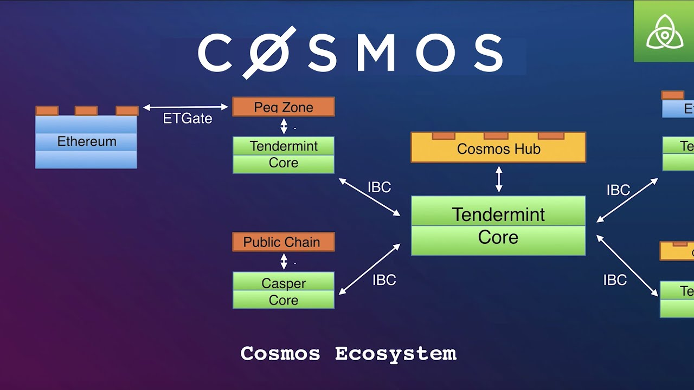

# Web3 Technical Overview - Part2

**Date:** Monday, March 31, 2025  

A technical overview about the Web3 and Blockchain ecosystems.

---

## 1. DeFi Protocols and Mechanisms

---

### DeFi Overview: The Money LEGOs
- **What is DeFi?**:  
  - Financial services (borrowing, trading, etc.) without centralized entities, built on blockchains like Ethereum.  
- **Growth**:  
  - Total Value Locked (TVL): $275M (2019) → $133B (Dec 2024).  
- **Why It Matters**:  
  - Transparent, accessible, efficient—removes intermediaries.  
- **Categories Covered**: Stablecoins, Exchanges, Lending, Derivatives, Fund Management, Lottery, Payments, Insurance, Governance, Dashboards.  

<!-- Speaker Notes: DeFi lets users access financial services without banks, using smart contracts on blockchains like Ethereum. It’s called "Money LEGOs" because you can stack services together. TVL grew from $275M in 2019 to $86B by 2021—a massive leap! We’ll cover key categories, showing how they work and where Sherlock fits in securing them. (2 min) -->

---

### Stablecoins
- **What Are They?**:  
  - Cryptocurrencies pegged to stable assets (e.g., USD) to reduce volatility.  
- **Types**:  
  - Centralized (e.g., USDC, USDT): Fiat-backed, custodial risks.  
  - Decentralized (e.g., DAI, LUSD): Collateral-backed, oracle risks.  
- **Security Focus**:  
  - Audits for peg stability, oracle integrity—Sherlock audited MakerDAO (DAI).  

<!-- Speaker Notes: Stablecoins like USDC and DAI keep prices steady, crucial for DeFi usability. Centralized ones like USDC rely on banks, while DAI uses crypto collateral. Bugs in oracles or peg mechanisms can break them—Sherlock’s audits, like for MakerDAO, ensure they hold up. (2 min) -->

---

### DEXes: On-Chain
- **Uniswap**:  
  - AMM model, liquidity pools—no order books, users provide liquidity.  
  - Risks: Impermanent loss, oracle manipulation.  
- **Security Focus**:  
  - Audit pool logic, price feeds—Sherlock audited Unstoppable DeFi (Margin DEX).  

<!-- Speaker Notes: On-chain DEXes like Uniswap use AMMs—think of them as token vending machines. Users provide liquidity but face risks like impermanent loss. Sherlock audits these, like Unstoppable DeFi’s Margin DEX on Arbitrum, to secure pool logic and oracles. (2 min) -->

---

### DEXes: Off-Chain
- **dYdX**:  
  - Off-chain order books, on-chain settlement—faster, pro-trading focus.  
  - Risks: Front-running, off-chain data integrity.  
- **Security Focus**:  
  - Audit matching engines, settlement logic—Sherlock audited dYdX.  

<!-- Speaker Notes: dYdX blends off-chain speed with on-chain security—great for traders but risks front-running. Sherlock’s audit of dYdX ensures the matching engine and settlement are tamper-proof. (2 min) -->

---

### Lending & Borrowing
- **Protocols (e.g., Aave, Compound)**:  
  - Overcollateralized loans, flash loans (Aave), algorithmic rates (Compound).  
  - Risks: Flash loan attacks, liquidation bugs, rate manipulation.  
- **Security Focus**:  
  - Audits for loan logic, collateral systems—Sherlock audited Aave, Compound.  

<!-- Speaker Notes: Aave and Compound let you borrow by locking crypto—flash loans are instant but risky; rates adjust dynamically but can be gamed. Sherlock’s audits of Aave and Compound ensure these systems are secure. (2 min) -->

---

### Derivatives
- **Synthetix**:  
  - Synthetic assets (Synths) track real-world assets (e.g., stocks, gold).  
  - Risks: Oracle failures, collateral mismanagement.  
- **Security Focus**:  
  - Audits for Synth creation, oracle feeds—Sherlock audited Symmio (OTC derivatives).  

<!-- Speaker Notes: Derivatives like Synthetix’s Synths let you trade real-world assets on-chain—think gold without holding it. Oracles can fail, though. Sherlock audited Symmio, a derivatives platform, to secure these mechanisms. (2 min) -->

---

### Fund Management

- **TokenSets**:  
  - Passive strategies (e.g., Index Sets, Yield Farming Sets).  
  - Risks: Strategy logic errors, market volatility exposure.  
- **Security Focus**:  
  - Audits for automated strategies—Sherlock audited PinLink (RWA platform).  

<!-- Speaker Notes: TokenSets automates investing—like index funds but decentralized. Errors in strategy code can hurt returns. Sherlock’s audit of PinLink, which manages tokenized assets, ensures these systems are safe. (2 min) -->

---

### Lottery / Games

- **PoolTogether**:  
  - No-loss lotteries: Pool funds, earn interest, random winner gets interest.  
  - Risks: Randomness bugs, pool mismanagement.  
- **Security Focus**:  
  - Audits for fairness, fund handling—Sherlock audited PoolTogether or Yolo.  

<!-- Speaker Notes: PoolTogether’s no-loss lotteries are fun—your ticket gets refunded, but a winner takes the interest. Randomness bugs can skew results. Sherlock audited PoolTogether to ensure fairness and security. (2 min) -->

---

### Payments
- **Superform**:  
  - Streaming payments (e.g., pay-per-second for services).  
  - Risks: Streaming logic errors, fund leakage.  
- **Security Focus**:  
  - Audits for streaming mechanisms—Sherlock audited payment protocols.  

<!-- Speaker Notes: Sablier reimagines payments as streams—think paying for Netflix by the second. Bugs can drain funds unexpectedly. Sherlock audits streaming logic to prevent issues. (2 min) -->

---

### Insurance
- **Sherlock or Nexus Mutual**:  
  - Covers smart contract risks (e.g., bug-bounty, hacks).  
  - Risks: Claim assessment flaws, token economics issues.  
- **Security Focus**:  
  - Audits for coverage logic, token models—Sherlock .  

<!-- Speaker Notes: Nexus Mutual insures against smart contract hacks—a must for DeFi users. Flaws in claims or token models can break trust. Sherlock’s audit of Nexus Mutual ensures reliability. (2 min) -->

---

### DAOs and Governance
- **Aragon, Snapshot**:  
  - DAOs: Community-run protocols; Governance: Token-based voting.  
  - Risks: Vote manipulation, proposal exploits.  
- **Security Focus**:  
  - Audits for voting, execution—Sherlock audited Allo V2 (Gitcoin grants).  

<!-- Speaker Notes: DAOs like Aragon and tools like Snapshot enable community governance—think decentralized boardrooms. Vote manipulation is a risk. Sherlock audited Allo V2 for Gitcoin’s grants, securing voting systems. (2 min) -->

---

### DeFi Dashboards
- **Zapper**:  
  - Aggregates DeFi activities (e.g., track assets across protocols).  
  - Risks: Data integration errors, API vulnerabilities.  
- **Security Focus**:  
  - Audits for data accuracy, API security—Sherlock audited dashboard integrations.  

<!-- Speaker Notes: Zapper simplifies DeFi by showing all your assets in one place. Data errors or API issues can mislead users. Sherlock audits these integrations to ensure accuracy and security. (2 min) -->

---
## 2. Blockchain Ecosystem Overview - Non-EVM Chains

---

### Solana: Why It Exists
- **Problem**: Most blockchains are too slow for mass adoption of dApps.  
- **Solution**: Solana delivers high throughput (up to 65,000 TPS) and low latency.  
- **Impact**: Supports high-performance applications at scale.  
- **Example**: Raydium DEX powers high-frequency trading on Solana.  

<!-- Speaker Notes:  
Solana is all about speed—think 65,000 transactions per second versus Ethereum’s 15. It’s built to handle dApps like Serum DEX, where every millisecond counts.  
-->

---

### Solana: What’s Unique

- **Key Feature**: Proof of History (PoH).  
  - Timestamps transactions to streamline consensus and boost speed.  
- **Advantage**: Enables massive scalability without heavy reliance on sharding.  
- **Storage Account System**: Solana Programs are associated with a Storage Account and need to borrow storage.  
- **Security Note**: High throughput introduces concurrency risks in smart contracts.  

<!-- Speaker Notes:  
Proof of History is Solana’s secret sauce—it’s like a built-in clock for transactions, cutting consensus overhead. But that speed means smart contracts need extra scrutiny for timing bugs. Sherlock audits Solana’s Rust-based contracts to catch these issues.  
-->

---

### Cosmos: Why It Exists
- **Problem**: Blockchains operate in isolation, unable to communicate natively.  
- **Solution**: Cosmos enables developers to build custom, sovereign blockchains that interoperate via the Inter-Blockchain Communication (IBC) protocol.  
- **Impact**: Creates an "Internet of Blockchains" for seamless cross-chain functionality.  
- **Example**: Osmosis DEX runs as a standalone chain but connects to others via IBC.  

<!-- Speaker Notes:  
Cosmos tackles the silos in blockchain tech. Think of blockchains as isolated islands—Cosmos builds bridges with IBC, letting custom chains like Osmosis for DeFi thrive independently yet connect with others.  
-->

---

### Cosmos: What’s Unique
- **Key Feature**: Inter-Blockchain Communication (IBC) protocol.  
  - Allows sovereign chains to exchange data and assets securely.  
- **Advantage**: Developers can tailor blockchains to specific needs without sacrificing connectivity.  

<!-- Speaker Notes:  
IBC is Cosmos’s standout feature—it’s like the internet’s TCP/IP for blockchains. Each chain is independent, so a bug in one won’t crash all, but those IBC bridges need to be rock-solid. Sherlock audits these connections to prevent cross-chain exploits.  
-->

---

---

### Polkadot: Why It Exists
- **Problem**: New blockchains struggle to establish their own security.  
- **Solution**: Polkadot offers shared security through its Relay Chain, connecting specialized parachains.  
- **Impact**: Reduces the burden of bootstrapping security for individual chains.  
- **Example**: Acala (DeFi) and Moonbeam (EVM-compatible) leverage this model.  

<!-- Speaker Notes:  
Polkadot fixes the security startup problem. Instead of every chain building its own defenses, they tap into the Relay Chain’s shared security, letting them focus on their unique jobs—like Acala for DeFi.  
-->

---

### Polkadot: What’s Unique
- **Key Feature**: Shared security via the Relay Chain.  
  - Parachains inherit robust security without building it from scratch.  
- **Advantage**: Enables specialized chains under a unified security umbrella.  
- **Security Note**: Relay Chain bugs can affect all parachains, requiring thorough checks.  

<!-- Speaker Notes:  
Shared security is Polkadot’s edge—parachains get a head start by leaning on the Relay Chain. But if the Relay Chain has a flaw, it’s a network-wide risk, so auditing is critical. Sherlock ensures these systems are bulletproof.  
-->

---

---

## Aptos/Sui: Why They Exist

- **Problem**: Ethereum’s scalability limits dApp performance; safety concerns in smart contracts.  
- **Solution**: Aptos and Sui use the Move language for high scalability and secure smart contracts.  
- **Impact**: Enables fast, secure dApps with native asset management.  

<!-- Speaker Notes:  
Aptos and Sui, both built by ex-Meta engineers, aim to outpace Ethereum with Move, offering better scalability and safety. Aptos targets DeFi, while Sui leans into gaming and NFTs—both prioritize performance without sacrificing security.  
-->

---

## Aptos/Sui: What’s Unique

- **Key Feature**: Move language with resource-oriented design.  
  - Prevents reentrancy, ensures asset ownership integrity.  
- **Advantage**: High throughput (Aptos: ~160,000 TPS; Sui: parallel tx processing).  

<!-- Speaker Notes:  
Move’s resource model is a game-changer—it eliminates reentrancy by design, ensuring assets aren’t double-spent. Aptos and Sui leverage this for speed, but Move’s upgrade mechanisms can introduce risks—Sherlock audits these to keep things secure.  
-->

---

## TON, Cardano, and Beyond

- **TON (The Open Network)**:  
  - **Why**: Scalable messaging and dApps (Telegram integration).  
  - **Unique**: Sharding, FunC language for performance.  
  - **Security**: Concurrency risks in sharded architecture.  
- **Cardano**:  
  - **Why**: Research-driven, secure smart contracts.  
  - **Unique**: Ouroboros PoS, Haskell for Plutus dApps.  
  - **Security**: Formal verification, but logic bugs possible.  
- **Others (EOS, Tezos)**:  
  - Tezos: Michelson for formal verification, upgrade risks.  

<!-- Speaker Notes:  
TON scales with sharding, tied to Telegram for mass adoption—FunC needs concurrency checks. Cardano’s research focus uses Haskell for safety, but logic errors can slip through. EOS and Tezos offer performance and upgradability, but each has unique risks—Sherlock audits across these ecosystems.  
-->

---

## 3. Programming Languages in Web3

---

### General-Purpose vs. Purpose-Specific Languages
- **General-Purpose**:  
  - Broad use (e.g., C++, Python, JavaScript).  
  - Used in blockchain for infrastructure, off-chain logic.  
  - Flexible but not optimized for smart contracts.  
- **Purpose-Specific**:  
  - Designed for blockchains (e.g., Solidity, Clarity).  
  - Optimized for smart contracts, security, gas efficiency.  
- **Why It Matters**:  
  - Purpose-specific languages reduce vulnerabilities in on-chain code.  

<!-- Speaker Notes: General-purpose languages like C++ or JavaScript are versatile but not tailored for blockchain’s unique needs—like gas costs or immutability. Purpose-specific languages like Solidity are built for smart contracts, making them safer and more efficient for on-chain use. -->

---

### On-Chain vs. Off-Chain Code
- **On-Chain Code**:  
  - Runs on the blockchain (e.g., smart contracts).  
  - Languages: Solidity, Rust, Move, ... 
  - Focus: Security, gas optimization, immutability.  
- **Off-Chain Code**:  
  - Runs outside the blockchain (e.g., front-ends, oracles, helpers).  
  - Languages: Go, Rust, Javascript, ...
  - Focus: Scalability, user interaction.  

<!-- Speaker Notes: On-chain code, like smart contracts, lives on the blockchain—think Solidity for Ethereum. It needs to be secure and gas-efficient. Off-chain code, like JavaScript for dApp front-ends, handles user interaction but can introduce risks if it miscommunicates with the chain. Sherlock audits both layers. -->

---

### EVM Smart Contracts: Solidity

- Purpose Specific Language for EVM Smart Contracts
- **Use**: Ethereum, EVM chains.  
- **Syntax:** Similiar to Javascript
- **Security Challenges**:  
  - Reentrancy, integer overflows, gas limits.  

<!-- Speaker Notes: Solidity is the most common smart contract language, but it’s tricky. Common bugs like reentrancy can drain funds. Sherlock’s auditors are experts in spotting these. -->

---

### EVM Smart Contracts: Vyper

- Purpose Specific Language for EVM Smart Contracts
- **Use**: Ethereum, EVM chains.  
- **Syntax:** Similiar to Python 
- **Security Challenges**: Infamous Compiler Bug lead to Curve Exploit

---

### Smart Contracts: Rust

- **Use**: Solana, Polkadot, NEAR.  
- **Security Challenges**:  
  - Memory safety, concurrency issues.  

<!-- Speaker Notes: Rust is safer than Solidity but not immune to bugs. Concurrency in Solana can lead to race conditions—Sherlock audits these high-performance contracts. -->

---

### Clients/L2s: Go and Rust

- **Go**:  
  - Ethereum Geth, Optimism.  
  - Risks: Consensus bugs, DoS attacks.  
- **Rust**:  
  - Parity, Solana.  
  - Risks: Memory corruption, performance bottlenecks.  

<!-- Speaker Notes: Client software is the backbone of blockchains. Bugs here can crash networks or enable attacks. Sherlock audits client code to prevent such failures. -->

---

### AppChains: Go

- **Cosmos SDK**:  
  - Build custom chains with Tendermint.  
- **Security Focus**:  
  - Audit chain-specific logic, IBC connections.  

<!-- Speaker Notes: Cosmos chains are modular but each has unique risks. IBC connections must be secure—Sherlock audits these custom implementations. -->

---

### Aptos/Sui Smart Contracts: Move

- **Use**: Aptos, Sui blockchains.  
- **Features**:  
  - Resource-oriented, prevents reentrancy by design.  
  - High scalability for financial dApps.  
- **Security Focus**:  
  - Audit for logic errors, upgrade verifiability issues.  

<!-- Speaker Notes: Move, developed by ex-Facebook engineers, powers Aptos and Sui. It’s built for safety, preventing bugs like reentrancy, but each chain’s unique features need auditing—Sherlock ensures robustness. -->

---

### StarkNet: Cairo
- **Use**: StarkNet (Ethereum L2).  
- **Features**:  
  - Designed for ZK-rollups, STARK-provable programs.  
  - High throughput, low-cost transactions.  
- **Security Focus**:  
  - Audit cryptographic proofs, program logic.  

<!-- Speaker Notes: Cairo is purpose-built for StarkNet, enabling scalable L2 solutions via ZK proofs. Its complexity requires careful auditing of proofs and logic—Sherlock’s expertise ensures security. -->

---

### Stacks: Clarity

- **Use**: Stacks (Bitcoin L2).  
- **Features**:  
  - Decidable language, predictable execution.  
  - Private functions by default, enhances security.  
- **Security Focus**:  
  - Audit for contract design flaws, Bitcoin integration.  

<!-- Speaker Notes: Clarity, used on Stacks, prioritizes security for Bitcoin-based dApps. It’s predictable and secure by design, but integration with Bitcoin needs auditing—Sherlock covers this. -->

---

### Fuel: Sway

- **Use**: Fuel (Ethereum L2).  
- **Features**:  
  - Rust-based, for high-performance smart contracts.  
  - Optimized for FuelVM, focuses on parallelism.  
- **Security Focus**:  
  - Audit for concurrency, FuelVM-specific risks.  

<!-- Speaker Notes: Sway is a Rust-based language for Fuel, an L2 focused on scalability. Its parallelism boosts performance but introduces concurrency risks—Sherlock audits these contracts. -->

---

### TON and Beyond

- **TON (Solidity, FunC)**:  
  - Solidity for smart contracts, FunC for high-performance TON apps.  
  - Risks: Scalability focus, but complex concurrency.  
- **Others**:  
  - **Haskell (Cardano)**: Functional, for Plutus dApps.  

<!-- Speaker Notes: TON, tied to Telegram, uses Solidity and FunC for scalability—FunC’s performance focus needs concurrency audits. Haskell powers Cardano’s Plutus, C++ drives EOS—each has unique risks. Sherlock audits across these ecosystems. -->

---

## 4. Quick Q&A

<!-- Speaker Notes: Let’s open the floor for questions. Remember, Sherlock’s audits cover the full spectrum—from smart contracts to L2s and beyond. Tomorrow, we’ll dive deeper into security techniques. -->

---
