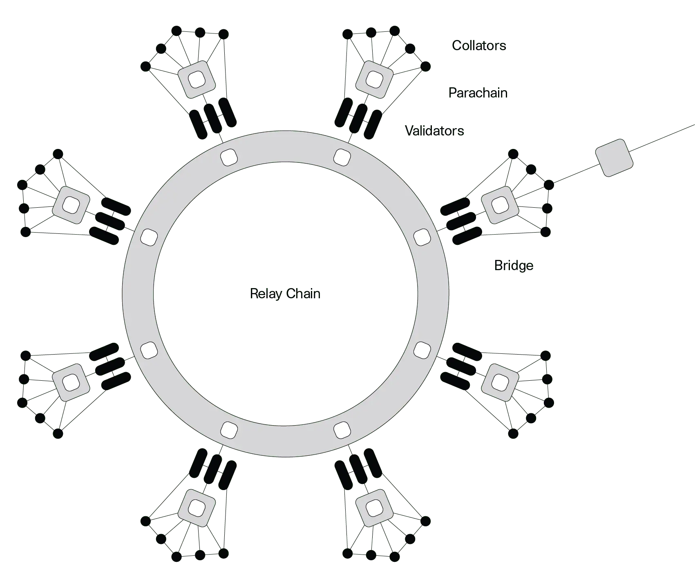

# Web3 Technical Overview - Part3

**Date:** Monday, April 23, 2025  

Overview about DeFi

---

## 1. DeFi Protocols and Mechanisms (ctd.)

---

### Derivatives
- **GMX**:  
  - **Mechanics**:  
    - Perpetual futures on Arbitrum/Avalanche, up to 50x leverage.  
    - Uses GLP pool (multi-asset: ETH, BTC, stablecoins) as counterparty; zero-price impact via Chainlink oracles.  
  - Risks: Oracle latency (slippage in volatile markets), liquidity scaling issues.  
- **Security Focus**:  
  - Audits for oracle integration, pool mechanics—Sherlock audited GMX and other derivatives protocols. 

<!-- Speaker Notes: GMX offers perpetual futures with up to 50x leverage—traders bet against the GLP pool, which holds assets like ETH and BTC. Chainlink oracles ensure zero-price impact, but latency can cause slippage. Sherlock audits these systems for robustness. (2 min) -->

---

### Lottery
- **PoolTogether**:  
  - **Mechanics**:  
    - No-loss lotteries: Users deposit (e.g., DAI), funds earn interest in lending pools (e.g., Compound).  
    - Interest goes to a random winner; users get deposits back.  
  - Risks: Randomness bugs, pool mismanagement.  
- **Security Focus**:  
  - Audits for fairness, fund handling—Sherlock audited PoolTogether.  

<!-- Speaker Notes: PoolTogether pools deposits, earns interest via lending, and awards it to a winner—everyone else gets their deposit back. Randomness bugs can skew winners. Sherlock audited PoolTogether for fairness. (2 min) -->

---

### Payments
- **Sablier**:  
  - **Mechanics**:  
    - Streaming payments: Pay-per-second (e.g., $1/sec for a service).  
    - Smart contract controls flow, stops if conditions fail.  
  - Risks: Streaming logic errors, fund leakage.  
- **Security Focus**:  
  - Audits for streaming mechanisms—Sherlock audited payment protocols.  

<!-- Speaker Notes: Sablier streams payments in real-time—think paying by the second. Smart contracts manage the flow, but bugs can drain funds. Sherlock audits these streaming systems for security. (2 min) -->

---

### Insurance
- **Sherlock**:  
  - **Mechanics**:  
    - Covers smart contract risks: Protocols deposit funds, get coverage for hacks (e.g., up to $10M).  
    - Stakers provide capital, earn premiums; claims handled via risk assessment.  
  - Risks: Claim assessment flaws, insufficient staked capital.  
- **Security Focus**:  
  - Sherlock audits its own coverage logic, ensuring robust protection for DeFi protocols.  

<!-- Speaker Notes: Sherlock’s coverage protects protocols from hacks—protocols deposit funds, stakers back coverage, and claims are assessed. Insufficient capital or flawed assessments are risks. Sherlock audits its own system to ensure reliability. (2 min) -->

---

### DAOs and Governance: veTokenomics
- **Aragon, Snapshot, Curve**:  
  - **Mechanics**:  
    - DAOs: Community-run via token voting (Aragon).  
    - veTokenomics (Curve): Vote-escrowed tokens (e.g., veCRV) lock CRV for voting power, directing emissions (gauge weights).  
  - Risks: Vote manipulation, proposal exploits, veCRV centralization.  
- **Security Focus**:  
  - Audits for voting, execution—Sherlock audited Allo V2 (Gitcoin grants).  

<!-- Speaker Notes: DAOs like Aragon use token voting for governance. Curve’s veTokenomics locks CRV into veCRV for voting—longer locks, more power to direct rewards. Risks include vote gaming or centralization. Sherlock audited Allo V2 for secure voting. (3 min) -->

---

### Fund Management / DeFi Strategies

- **Index**:  
  - **Mechanics**:  
    - Passive strategies: Index Sets (track baskets), Yield Farming Sets (optimize returns).  
    - Smart contracts rebalance based on predefined rules.  
  - Risks: Strategy logic errors, market volatility exposure.  
- **Security Focus**:  
  - Audits for automated strategies—Sherlock audited Index CooP

<!-- Speaker Notes: TokenSets automates investing—Index Sets track markets, Yield Sets chase returns via smart contracts. Bugs in rebalancing logic can hurt users. Sherlock audited PinLink, ensuring these strategies are safe. (2 min) -->

---

### Yield Aggregators
- **Yearn Finance**:  
  - **Mechanics**:  
    - Automates yield farming: Deposits (e.g., DAI) moved to highest-yield protocols (e.g., Aave, Compound).  
    - Vaults use strategies, earn fees (e.g., 2% performance fee).  
  - Risks: Strategy bugs, underlying protocol exploits.  
- **Security Focus**:  
  - Audits for strategy logic, integrations—Sherlock audited yield systems.  

<!-- Speaker Notes: Yearn optimizes returns by shifting funds to high-yield protocols—vaults execute strategies, users earn fees. Bugs in strategies or exploits in integrated protocols are risks. Sherlock audits these systems for safety. (2 min) -->

---

### Staking
- **Lido Finance**:  
  - **Mechanics**:  
    - Proof-of-Stake (PoS): Stake ETH to validate, earn rewards (e.g., Ethereum).  
    - Liquid Staking Derivatives (LSDs): Stake ETH, get stETH (1:1 peg), use in DeFi (e.g., lending).  
  - Risks: Depegging (stETH vs. ETH), slashing (validator penalties).  
- **Security Focus**:  
  - Audits for staking logic, derivative issuance—Sherlock audited staking protocols. 

<!-- Speaker Notes: Staking in PoS like Ethereum earns rewards but locks assets. Lido’s LSDs like stETH let you stake ETH and use it in DeFi—e.g., lending—while earning rewards. Risks include depegging or slashing. Sherlock audits these systems for security. (2 min) -->

---
## 2. Blockchain Ecosystem Overview - Non-EVM Chains

---

### Solana: Why It Exists
- **Problem**: Most blockchains are too slow for mass adoption of dApps.  
- **Solution**: Solana delivers high throughput (up to 65,000 TPS) and low latency.  
- **Impact**: Supports high-performance applications at scale.  
- **Example**: Raydium DEX powers high-frequency trading on Solana.  

<!-- Speaker Notes:  
Solana is all about speed—think 65,000 transactions per second versus Ethereum’s 15. It’s built to handle dApps like Serum DEX, where every millisecond counts.  
-->

---

### Solana: What’s Unique

- **Key Feature**: Proof of History (PoH).  
  - Timestamps transactions to streamline consensus and boost speed.  
- **Advantage**: Enables massive scalability without heavy reliance on sharding.  
- **Storage Account System**: Solana Programs are associated with a Storage Account and need to borrow storage.  
- **Security Note**: High throughput introduces concurrency risks in smart contracts.  

<!-- Speaker Notes:  
Proof of History is Solana’s secret sauce—it’s like a built-in clock for transactions, cutting consensus overhead. But that speed means smart contracts need extra scrutiny for timing bugs. Sherlock audits Solana’s Rust-based contracts to catch these issues.  
-->

---

### Cosmos: Why It Exists
- **Problem**: Blockchains operate in isolation, unable to communicate natively.  
- **Solution**: Cosmos enables developers to build custom, sovereign blockchains that interoperate via the Inter-Blockchain Communication (IBC) protocol.  
- **Impact**: Creates an "Internet of Blockchains" for seamless cross-chain functionality.  
- **Example**: Osmosis DEX runs as a standalone chain but connects to others via IBC.  

<!-- Speaker Notes:  
Cosmos tackles the silos in blockchain tech. Think of blockchains as isolated islands—Cosmos builds bridges with IBC, letting custom chains like Osmosis for DeFi thrive independently yet connect with others.  
-->

---

### Cosmos: What’s Unique
- **Key Feature**: Inter-Blockchain Communication (IBC) protocol.  
  - Allows sovereign chains to exchange data and assets securely.  
- **Advantage**: Developers can tailor blockchains to specific needs without sacrificing connectivity.  

<!-- Speaker Notes:  
IBC is Cosmos’s standout feature—it’s like the internet’s TCP/IP for blockchains. Each chain is independent, so a bug in one won’t crash all, but those IBC bridges need to be rock-solid. Sherlock audits these connections to prevent cross-chain exploits.  
-->

---

---

### Polkadot: Why It Exists
- **Problem**: New blockchains struggle to establish their own security.  
- **Solution**: Polkadot offers shared security through its Relay Chain, connecting specialized parachains.  
- **Impact**: Reduces the burden of bootstrapping security for individual chains.  
- **Example**: Acala (DeFi) and Moonbeam (EVM-compatible) leverage this model.  

<!-- Speaker Notes:  
Polkadot fixes the security startup problem. Instead of every chain building its own defenses, they tap into the Relay Chain’s shared security, letting them focus on their unique jobs—like Acala for DeFi.  
-->

---

### Polkadot: What’s Unique
- **Key Feature**: Shared security via the Relay Chain.  
  - Parachains inherit robust security without building it from scratch.  
- **Advantage**: Enables specialized chains under a unified security umbrella.  
- **Security Note**: Relay Chain bugs can affect all parachains, requiring thorough checks.  

<!-- Speaker Notes:  
Shared security is Polkadot’s edge—parachains get a head start by leaning on the Relay Chain. But if the Relay Chain has a flaw, it’s a network-wide risk, so auditing is critical. Sherlock ensures these systems are bulletproof.  
-->

---

---

## Aptos/Sui: Why They Exist

- **Problem**: Ethereum’s scalability limits dApp performance; safety concerns in smart contracts.  
- **Solution**: Aptos and Sui use the Move language for high scalability and secure smart contracts.  
- **Impact**: Enables fast, secure dApps with native asset management.  

<!-- Speaker Notes:  
Aptos and Sui, both built by ex-Meta engineers, aim to outpace Ethereum with Move, offering better scalability and safety. Aptos targets DeFi, while Sui leans into gaming and NFTs—both prioritize performance without sacrificing security.  
-->

---

## Aptos/Sui: What’s Unique

- **Key Feature**: Move language with resource-oriented design.  
  - Prevents reentrancy, ensures asset ownership integrity.  
- **Advantage**: High throughput (Aptos: ~160,000 TPS; Sui: parallel tx processing).  

<!-- Speaker Notes:  
Move’s resource model is a game-changer—it eliminates reentrancy by design, ensuring assets aren’t double-spent. Aptos and Sui leverage this for speed, but Move’s upgrade mechanisms can introduce risks—Sherlock audits these to keep things secure.  
-->

---

## TON, Cardano, and Beyond

- **TON (The Open Network)**:  
  - **Why**: Scalable messaging and dApps (Telegram integration).  
  - **Unique**: Sharding, FunC language for performance.  
  - **Security**: Concurrency risks in sharded architecture.  
- **Cardano**:  
  - **Why**: Research-driven, secure smart contracts.  
  - **Unique**: Ouroboros PoS, Haskell for Plutus dApps.  
  - **Security**: Formal verification, but logic bugs possible.  
- **Others (EOS, Tezos)**:  
  - Tezos: Michelson for formal verification, upgrade risks.  

<!-- Speaker Notes:  
TON scales with sharding, tied to Telegram for mass adoption—FunC needs concurrency checks. Cardano’s research focus uses Haskell for safety, but logic errors can slip through. EOS and Tezos offer performance and upgradability, but each has unique risks—Sherlock audits across these ecosystems.  
-->

---

## 3. Programming Languages in Web3

---

### General-Purpose vs. Purpose-Specific Languages
- **General-Purpose**:  
  - Broad use (e.g., C++, Python, JavaScript).  
  - Used in blockchain for infrastructure, off-chain logic.  
  - Flexible but not optimized for smart contracts.  
- **Purpose-Specific**:  
  - Designed for blockchains (e.g., Solidity, Clarity).  
  - Optimized for smart contracts, security, gas efficiency.  
- **Why It Matters**:  
  - Purpose-specific languages reduce vulnerabilities in on-chain code.  

<!-- Speaker Notes: General-purpose languages like C++ or JavaScript are versatile but not tailored for blockchain’s unique needs—like gas costs or immutability. Purpose-specific languages like Solidity are built for smart contracts, making them safer and more efficient for on-chain use. -->

---

### On-Chain vs. Off-Chain Code
- **On-Chain Code**:  
  - Runs on the blockchain (e.g., smart contracts).  
  - Languages: Solidity, Rust, Move, ... 
  - Focus: Security, gas optimization, immutability.  
- **Off-Chain Code**:  
  - Runs outside the blockchain (e.g., front-ends, oracles, helpers).  
  - Languages: Go, Rust, Javascript, ...
  - Focus: Scalability, user interaction.  

<!-- Speaker Notes: On-chain code, like smart contracts, lives on the blockchain—think Solidity for Ethereum. It needs to be secure and gas-efficient. Off-chain code, like JavaScript for dApp front-ends, handles user interaction but can introduce risks if it miscommunicates with the chain. Sherlock audits both layers. -->

---

### EVM Smart Contracts: Solidity

- Purpose Specific Language for EVM Smart Contracts
- **Use**: Ethereum, EVM chains.  
- **Syntax:** Similiar to Javascript
- **Security Challenges**:  
  - Reentrancy, integer overflows, gas limits.  

<!-- Speaker Notes: Solidity is the most common smart contract language, but it’s tricky. Common bugs like reentrancy can drain funds. Sherlock’s auditors are experts in spotting these. -->

---

### EVM Smart Contracts: Vyper

- Purpose Specific Language for EVM Smart Contracts
- **Use**: Ethereum, EVM chains.  
- **Syntax:** Similiar to Python 
- **Security Challenges**: Infamous Compiler Bug lead to Curve Exploit

---

### Smart Contracts: Rust

- **Use**: Solana, Polkadot, NEAR.  
- **Security Challenges**:  
  - Memory safety, concurrency issues.  

<!-- Speaker Notes: Rust is safer than Solidity but not immune to bugs. Concurrency in Solana can lead to race conditions—Sherlock audits these high-performance contracts. -->

---

### Clients/L2s: Go and Rust

- **Go**:  
  - Ethereum Geth, Optimism.  
  - Risks: Consensus bugs, DoS attacks.  
- **Rust**:  
  - Parity, Solana.  
  - Risks: Memory corruption, performance bottlenecks.  

<!-- Speaker Notes: Client software is the backbone of blockchains. Bugs here can crash networks or enable attacks. Sherlock audits client code to prevent such failures. -->

---

### AppChains: Go

- **Cosmos SDK**:  
  - Build custom chains with Tendermint.  
- **Security Focus**:  
  - Audit chain-specific logic, IBC connections.  

<!-- Speaker Notes: Cosmos chains are modular but each has unique risks. IBC connections must be secure—Sherlock audits these custom implementations. -->

---

### Aptos/Sui Smart Contracts: Move

- **Use**: Aptos, Sui blockchains.  
- **Features**:  
  - Resource-oriented, prevents reentrancy by design.  
  - High scalability for financial dApps.  
- **Security Focus**:  
  - Audit for logic errors, upgrade verifiability issues.  

<!-- Speaker Notes: Move, developed by ex-Facebook engineers, powers Aptos and Sui. It’s built for safety, preventing bugs like reentrancy, but each chain’s unique features need auditing—Sherlock ensures robustness. -->

---

### StarkNet: Cairo
- **Use**: StarkNet (Ethereum L2).  
- **Features**:  
  - Designed for ZK-rollups, STARK-provable programs.  
  - High throughput, low-cost transactions.  
- **Security Focus**:  
  - Audit cryptographic proofs, program logic.  

<!-- Speaker Notes: Cairo is purpose-built for StarkNet, enabling scalable L2 solutions via ZK proofs. Its complexity requires careful auditing of proofs and logic—Sherlock’s expertise ensures security. -->

---

### Stacks: Clarity

- **Use**: Stacks (Bitcoin L2).  
- **Features**:  
  - Decidable language, predictable execution.  
  - Private functions by default, enhances security.  
- **Security Focus**:  
  - Audit for contract design flaws, Bitcoin integration.  

<!-- Speaker Notes: Clarity, used on Stacks, prioritizes security for Bitcoin-based dApps. It’s predictable and secure by design, but integration with Bitcoin needs auditing—Sherlock covers this. -->

---

### Fuel: Sway

- **Use**: Fuel (Ethereum L2).  
- **Features**:  
  - Rust-based, for high-performance smart contracts.  
  - Optimized for FuelVM, focuses on parallelism.  
- **Security Focus**:  
  - Audit for concurrency, FuelVM-specific risks.  

<!-- Speaker Notes: Sway is a Rust-based language for Fuel, an L2 focused on scalability. Its parallelism boosts performance but introduces concurrency risks—Sherlock audits these contracts. -->

---

### TON and Beyond

- **TON (Solidity, FunC)**:  
  - Solidity for smart contracts, FunC for high-performance TON apps.  
  - Risks: Scalability focus, but complex concurrency.  
- **Others**:  
  - **Haskell (Cardano)**: Functional, for Plutus dApps.  

<!-- Speaker Notes: TON, tied to Telegram, uses Solidity and FunC for scalability—FunC’s performance focus needs concurrency audits. Haskell powers Cardano’s Plutus, C++ drives EOS—each has unique risks. Sherlock audits across these ecosystems. -->

---

### Languages Overview
| **Language** | **Primary Usage**         | **Blockchains**         | **Security Considerations**         |
|--------------|---------------------------|-------------------------|-------------------------------------|
| Solidity     | Smart Contracts           | Ethereum, EVM chains    | Reentrancy, gas limits, overflows   |
| Rust         | Smart Contracts, Clients  | Solana, Polkadot, NEAR  | Concurrency, memory safety          |
| Go           | Clients, AppChains        | Ethereum (Geth), Cosmos | Consensus bugs, DoS attacks         |
| Move         | Smart Contracts           | Aptos, Sui              | Logic errors, upgrade issues        |
| Cairo        | Smart Contracts           | StarkNet (L2)           | Cryptographic proofs, logic flaws   |
| Clarity      | Smart Contracts           | Stacks (Bitcoin L1)     | Design flaws, Bitcoin integration   |
| Sway         | Smart Contracts           | Fuel (L2)               | Concurrency, FuelVM-specific risks  |
| FunC         | Smart Contracts           | TON                     | Concurrency in sharded systems      |
| Haskell      | Smart Contracts           | Cardano                 | Logic bugs despite formal methods   |
| C++          | Infrastructure, Contracts | EOS                     | System-level vulnerabilities        |

<!-- Speaker Notes: This table summarizes Web3 languages—Solidity dominates Ethereum, Rust powers Solana, Go drives Cosmos, and newer ones like Move and Cairo target specific chains. Each has unique risks, from reentrancy in Solidity to concurrency in FunC. Sherlock audits them all to secure Web3. -->

-- 

## 4. Quick Q&A

<!-- Speaker Notes: Let’s open the floor for questions. Remember, Sherlock’s audits cover the full spectrum—from smart contracts to L2s and beyond. Tomorrow, we’ll dive deeper into security techniques. -->

---
